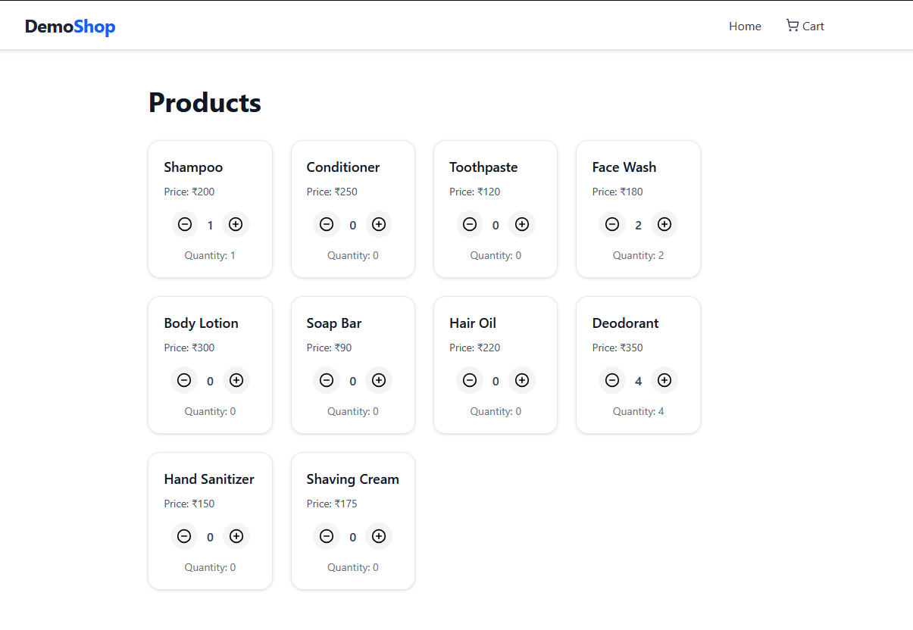
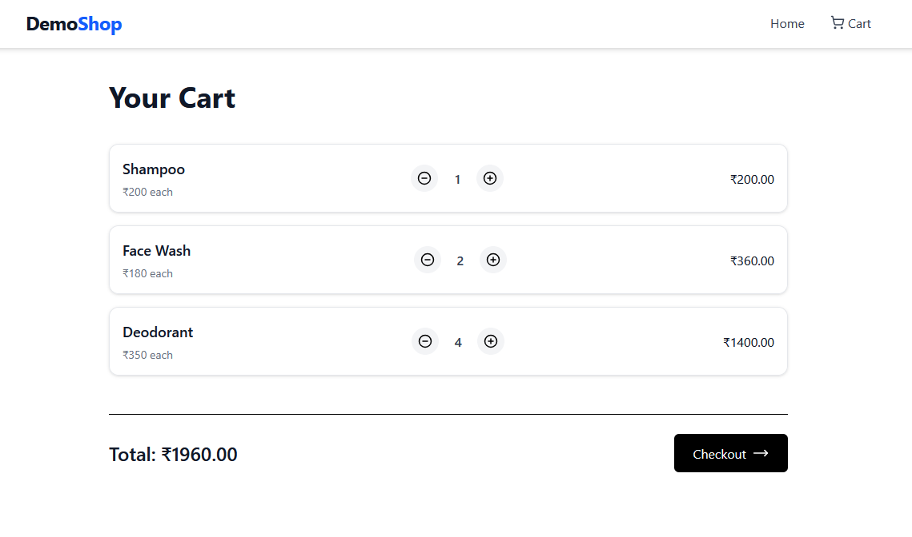
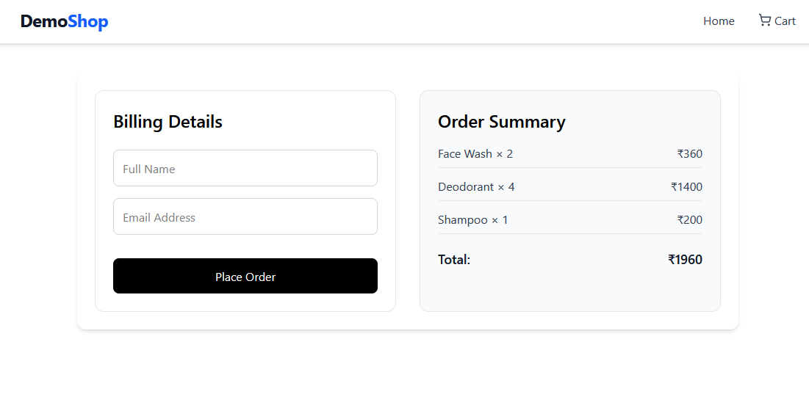

# Mock E-Commerce Cart 

A simple full-stack shopping cart app.  
Implements essential e-commerce flows — product listing, cart management, and mock checkout with PDF receipt generation.

---

## Features

### Frontend (React + TypeScript)
- Product grid with “Add to Cart” buttons  
- Cart page showing items, quantity, and total  
- Checkout form (name, email)  
- PDF invoice automatically downloads after checkout  
- Responsive minimalist UI with TailwindCSS  

### Backend (Node.js + Express + MongoDB)
- REST APIs:
  - `GET /api/products` → Fetch all products  
  - `POST /api/cart/:productId` → Add item to cart  
  - `DELETE /api/cart/:productId` → Remove or decrement quantity  
  - `GET /api/cart` → Get cart + total  
  - `POST /api/checkout` → Generate PDF invoice  
- MongoDB persistence using Mongoose  
- PDF invoice generated via **pdfkit**

---

## Tech Stack

**Frontend:** React + TypeScript + TailwindCSS  
**Backend:** Node.js + Express + MongoDB  
**Database:** MongoDB Atlas / Local Mongo  
**PDF:** pdfkit  

---

## Project Setup

### 1️. Clone the repository
```bash
  git clone https://github.com/karthik-bha/e-commerce-cart.git
  cd e-commerce-cart
```

### 2. Setup Backend
```bash
  cd backend
  npm install
```
#### Create a .env file in the backend folder:
```bash
  MONGO_URL=your_mongodb_connection_string
  PORT=3000
```
#### Run the backend:
```bash
  nodemon index.js
```
#### Backend runs on: http://localhost:3000

### 3. Setup Frontend
```bash
  cd frontend
  npm install
  npm run dev
```

#### Frontend runs on: http://localhost:5173

| Method | Endpoint               | Description                 |
| ------ | ---------------------- | --------------------------- |
| GET    | `/api/products`        | Fetch all products          |
| POST   | `/api/cart/:productId` | Add product to cart         |
| DELETE | `/api/cart/:productId` | Remove/decrement product    |
| GET    | `/api/cart`            | Get all cart items + total  |
| POST   | `/api/checkout`        | Generate mock invoice (PDF) |





 ### Notes

  - “guest” user used for mock persistence

  - Cart and product data stored in MongoDB

  - Checkout automatically triggers invoice download
  
### Folder Structure
nexora/
│
├── backend/
│   ├── models/
│   ├── db/
│   ├── index.js
│   └── ...
│
├── frontend/
│   ├── src/
│   ├── components/
│   ├── pages/
│   └── ...
│
└── README.md


